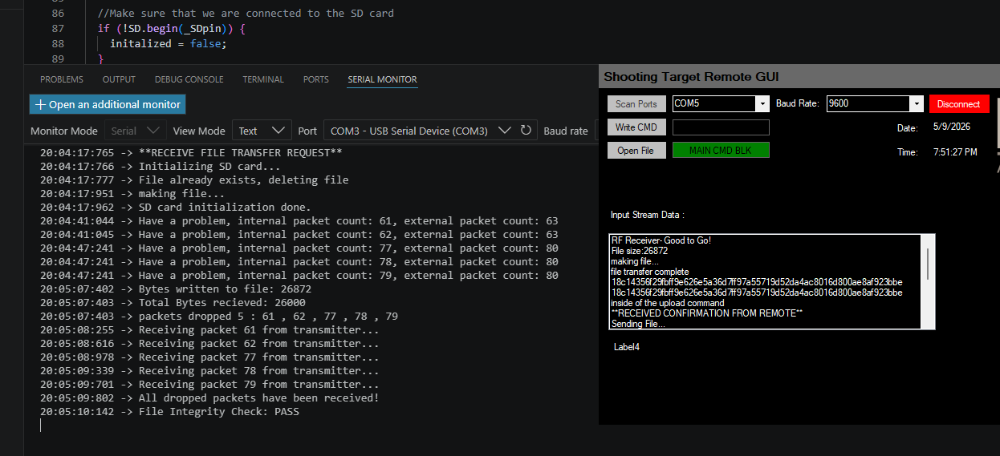

# Secure RF95 LoRa Telemetry & Systems Integration
**Hardware:** SAMD21 (Cortex-M0+) | **Radio:** RF95 (LoRa) | **Security:** Speck Cipher | **Control:** Visual Basic GUI

---
[](https://www.gnu.org/licenses/gpl-3.0)
[](https://ww1.microchip.com/downloads/aemDocuments/documents/MCU32/ProductDocuments/DataSheets/SAM-D21-DA1-Family-Data-Sheet-DS40001882.pdf)
[](https://www.hoperf.com/modules/lora/RFM95W.html#apDocument)


## 🛠️ Project Overview
This is an end-to-end embedded system designed for secure, long-range binary file transfer. It bridges the gap between hardware-level encryption and high-level user control, featuring a custom-built PC interface to manage the SAMD21 firmware.

--- 

## Table of Contents
* [Getting Started](#getting-started)
* [ Core Security & Networking Features](#️-core-security--networking-features)
* [System Integration (PC-to-hardware)](#️-systems-integration-pc-to-hardware)
* [Verification & Reliability](#-verification--reliability)
* [Code Spotlight](#-code-spotlight-multi-bank-binary-hashing)
* [Refactoring & Professional Engineering](#️-refactoring--professional-engineering)
* [Sytem Architecture](#-system-architecture)
* [API Usage](#-api-usage-filetransfer-library)
* [Professional Development Workflow](#-professional-development-workflow)
* [Development History](#-development-history)
* [License & Credits](#️-license--credits)


## Getting Started

### Prerequisites
* [Visual Studio Code](https://visualstudio.com)
* [PlatformIO IDE Extension](https://platformio.org)

### Installation & Build
1. **Clone the repository:**
```bash
git clone https://github.com/TacTechGuy/SAMD21_RF95_FOTA_CLIENT
cd SAMD21_RF95_FOTA_CLIENT
```

2. **Configure Secrets:**
Rename `secrets.h.example` to `secrets.h` and add your cipher key to the **template**

3. **Select Environment:**
In the PlatformIO status bar, choose your target environment:
* `env:sender` — For the Sender/ client.
* `env:receiver` — For the Receiver/FOTA client.

4. **Build and Upload:**
Click the **PlatformIO: Build** (check icon) **Select** appropriate com port **PlatformIO: Upload** (arrow icon) in the status bar. 

---

## 🛡️ Core Security & Networking Features
*   **Speck Block Cipher:** Lightweight 128-bit encryption optimized for resource-constrained MCUs.
*   **Modified RadioHead Driver:** Custom-modified `RHEncryptedDriver` to bridge the Speck implementation with the LoRa transport layer.
*   **Binary Integrity Hashing:** A custom 32-bit word, multi-bank hashing algorithm designed to verify file integrity "at-rest" on the SD card.
*   **Secret Management:** Professional isolation of cryptographic keys via `secrets.h` and `.gitignore` protocols.

## 🖥️ Systems Integration (PC-to-Hardware)
To facilitate testing and deployment, a custom **Visual Basic Serial GUI** was developed. This tool allows for:
*   Real-time command execution from a PC to the SAMD21.
*   Monitoring of file transfer progress and hash verification.
*   Hardware-in-the-loop (HIL) testing of the RF95 radio states.

---

## 🔍 Verification & Reliability
To guarantee 100% data fidelity, the system performs a final verification pass after the binary stream is reassembled.

#### **Post-Reception Integrity Check**
The system identifies packet loss via sequence tracking and triggers automatic requests. The final file integrity is then validated using the custom hashing routine.

  
*The capture above demonstrates the system flagging a mismatch, recovering missing data, and concluding with a "Hash Match" confirmation.*
### 🔍 Static Analysis & Quality Assurance (WIP)
This project integrates **Cppcheck** for automated static analysis to maintain high code quality standards.

**Current Audit Status:**
- **High Severity:** 0 Issues (Verified)
- **Medium Severity:** 30 Identified (Refactoring in progress)
- **Low/Style:** 72 Identified

> **Refactoring Notice:** I am currently addressing 30 medium-severity `uninitMemberVar` warnings. These are being resolved by migrating class constructors to **Member Initializer Lists** to ensure strict memory safety and eliminate non-deterministic behavior. This cleanup is scheduled for completion in the upcoming sprints.

#### QA Roadmap
1. [x] Initial Static Analysis Audit.
2. [ ] Refactor `fileTransfer` constructors to initialize all member variables.
3. [ ] Implement explicit type casting to resolve implicit conversion warnings.
4. [ ] Achieve a "Zero-Medium-Issue" baseline for the core library.


---

## 💻 Code Spotlight: Multi-Bank Binary Hashing
To maintain 100% data integrity without the overhead of heavy cryptographic libraries, I developed a 32-bit word, multi-bank state machine. This routine processes the binary stream in chunks, distributing entropy across an 8-bank state array.

```cpp
// Logic Core: 32-bit Word Assembly & State Transformation
_hashBank |= stream << (24 - (_bitShiftCount * 8));

if ((_count % 4) == 0) {
    _hashBankCount++; 
    
    // Distribute entropy across 8 internal 32-bit banks
    // Each bank uses a unique constant/salt to prevent bit-collisions
    switch (_hashBankCount) {
        case 1: 
            _hashArray[1] = (_hashBank != 0) ? _hashBank ^= _hashArray[1] : 0xC5A14356; 
            break;
        case 2: 
            _hashArray[2] = (_hashBank != 0) ? _hashBank ^= ~_hashArray[2] : 0x84014006; 
            break;
        // ... Logic continues across 8 state banks ...
    }
    _hashBank = 0; // Reset for next word
}
```
---

## 🏗️ Refactoring & Professional Engineering
The project was recently migrated to **PlatformIO** to implement professional software patterns:

*   **Logic Modularization:** Extracted hashing and transfer logic from monolithic loops into testable C++ classes.
*   **Type Safety:** Standardized on `uint8_t` and `uint32_t` for all binary operations to prevent sign-extension bugs.
*   **Multi-Bank Hashing:** Processes data in 32-bit words across 8 internal state banks to maximize entropy and minimize RAM footprint.

---

## 📂 System Architecture
*   `src/`: Dedicated build targets for **Transmitter** and **Receiver** roles.
*   `lib/`: Modularized libraries for RadioHead, Speck, and FileTransfer logic.
*   `tools/`: Visual Basic source code for the Serial Control Interface.
*   `include/`: Private configuration and security headers.

---

## 📝 API Usage (FileTransfer Library)
1. **Serial GUI:** `fileTransfer.receiveCommandLocal();` 
2. **Client Com:** `fileTransfer.packetDataAvailable("client");` //**client** [receiver/sender]
3. **Initialize:** `fileTransfer.initalizeHashFile(file, "operation");` //operation [read/write]
4. **Process:** `fileTransfer._hashFileStream();` // Streams file from SD in 32-bit blocks
5. **Validate:** `fileTransfer._checkFileIntegrity();` 
 

  

---

## 🚀 Professional Development Workflow
- [x] Separation of Secrets (DevSecOps best practices).
- [x] Modular C++ Library Design.
- [x] End-to-End Verification: Hardware-in-the-loop (HIL) testing confirmed via GUI.
- [x] Version Control (Git) with structured refactor history.
- [ ] *Next Step: 1* Implement standardized code comments using Doxygen
- [ ] *Next Step: 2* Implementing Native Unit Testing for hashing entropy.

---

## 👨‍💻 Development History
Evolved from several specialized test environments:
*   **Serial Interface:** Command-line testing between a custom VB GUI and SAMD21.
*   **SD Binary Testing:** Isolated file read/write performance benchmarks.
*   **Legacy Integration:** Merged standalone `serialCommands` and `ReadWriteSDBinary` sketches into a unified, modular system.

## ⚖️ License & Credits
*   **RadioHead Library:** This project utilizes the [RadioHead Packet Radio Library](http://www.airspayce.com/mikem/arduino/RadioHead/), Copyright (C) Mike McCauley. It is used under the **GNU GPL v3** license.
*   **Project License:** This repository is licensed under the **GNU General Public License v3.0 (GPL-3.0)** in accordance with the copyleft requirements of its dependencies.


